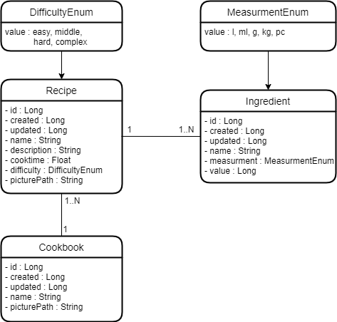
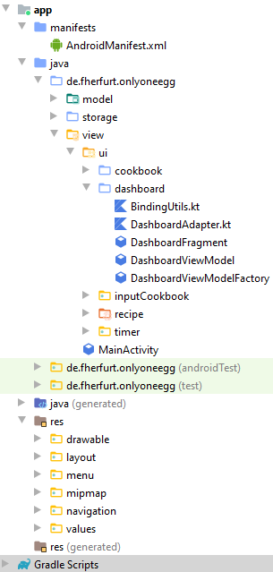

#  OnlyOneEgg 

### Mitglieder: Bilal Alnaani, Olga Klassen, Franziska Schmidt, Tom Käppler

### Projektbeschreibung:
Mit der App "OnlyoneEgg" kannst du deine vergilbten und befleckten Kochbücher vergessen. Erstelle dir einfach ein eigenes Kochbuch, lege Rezepte an und verwalte sie.
Füge zu jedem Kochbuch ein eigenes Foto aus deiner Gallerie des Smartphones hinzu und speichere deine Lieblingsrezepte darunter ab. 
Ein Kochbuch kann dabei mehrere oder auch kein Rezept enthalten.

Um nicht alle deine Kochbücher nach einem bestimmten Rezept einzeln durchsuchen zu müssen, kannst du einfach den praktischen Rezeptfinder nutzen. 
Er durchsucht selbstständig alle Kochbücher und zeigt dir die Ergebnisse an.

Solltest du gerade keine Eieruhr zur Hand haben, hilft dir der integrierte Timer weiter. Stell die gewünschte Zeit ein und warte auf den Signalton. So kann garantiert nichts mehr anbrennen.

Möchtest du deine Rezepte mit Freunden teilen, ist auch das kein Problem. Die App ermöglicht es dir deine Rezepte in eine JSON-Datei zu exportieren. 
Deine Freunde brauchen diese nur noch zu importieren und können alles nachkochen.

Wir wünschen dir viel Spaß!

### Room-Datenbankklassen

### Projektstruktur

### Seiten:
- [x] Startseite/Dashboard
  - [x] Eigene Kochbücher anzeigen
  - [x] Neues Kochbuch hinzufügen
	  - [x] Name
    - [x] Bild
- [x] Kochbuchansicht
  - [x] Liste von Rezepten
  - [x] Rezept hinzufügen
  	- [x] Name, Zutaten, Anleitung, Schwierigkeit, Dauer
  - [x] Rezept löschen
- [x] Rezeptansicht
  - [x] Kochbuchbild
  - [x] Liste von Zutaten
  - [x] Kochanleitung
  - [x] Löschen
- [x] Rezeptfinder
  - [x] Eingabe
  - [x] Liste von Rezepten
- [x] Timer-Seite

### Lessons Learned:

- Android/Kotlin Fundamentals Kurs war sehr hilfreich
- Wöchentliche Meetings durch Online-Tools. Austausch über Fortschritt, beendete und anstehende Aufgaben 
- Allgemein Fragen stellen und bei Schwierigkeiten aktiv Hilfe suchen: Lieber einmal mehr Fragen als einmal zu wenig.
- Arbeitstrennung nach Seiten/Packages/Fragmenten sehr angenehm (Jeder macht Frontend + Backend, Absprachen untereinander)
- öfter mal den Elefanten drücken (sync gradle)
