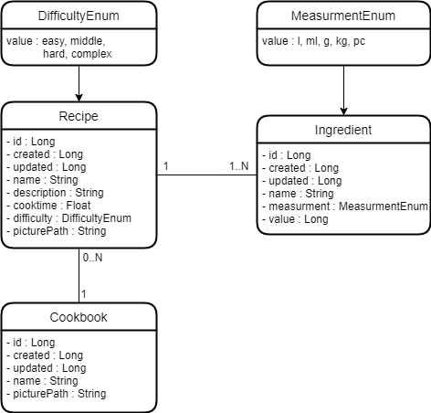

#  OnlyOneEgg 

### Mitglieder: Bilal Alnaani, Olga Klassen, Franziska Schmidt, Tom Käppler

### Projektbeschreibung:
- Kochbuch-App für Android
- Rezeptlisten und Rezepte hinzufügen
- Rezepte sharen und runterladen
- Rezeptfinder nach Zutaten
- Timer für Ofen/Ruhezeit etc.
- Interaktive Rezepte
- (Rezeptexport als PDF, JSON)
- (Voicecontrol)
- (Gruppen und Einladen von Freunden)

### Room-Datenbankklassen

### Projektstruktur

### Seiten:
- [x] Startseite/Dashboard
  - [x] Eigene Kochbücher anzeigen
  - [x] Neues Kochbuch hinzufügen
	  - [x] Name
    - [ ] Bild
- [x] Kochbuchansicht
  - [x] Liste von Rezepten
  - [x] Rezept hinzufügen
  	- [x] Name, Bild(er), Zutaten, Anleitung, Schwierigkeit, Dauer
  - [x] Rezept löschen
- [x] Rezeptansicht
  - [x] Liste von Zutaten
  - [x] Kochanleitung
  - [ ] Ändern
  - [x] Löschen
- [x] Rezeptfinder
  - [x] Eingabe
  - [x] Liste von Rezepten
- [x] Timer-Seite

### Lessons Learned:

- Android/Kotlin Fundamentals Kurs war sehr hilfreich
- Wöchentliche Meetings durch Online-Tools. Austausch über Fortschritt und anstehende Aufgaben 
- Allgemein Fragen stellen und bei Schwierigkeiten aktiv Hilfe suchen: Lieber einmal mehr Fragen als einmal zu wenig.
- Arbeitstrennung nach Seiten/Packages/Fragmenten sehr angenehm (Jeder macht Frontend + Backend, Absprachen untereinander)
- Bilals Essensgewohnheiten in Bild und Ton